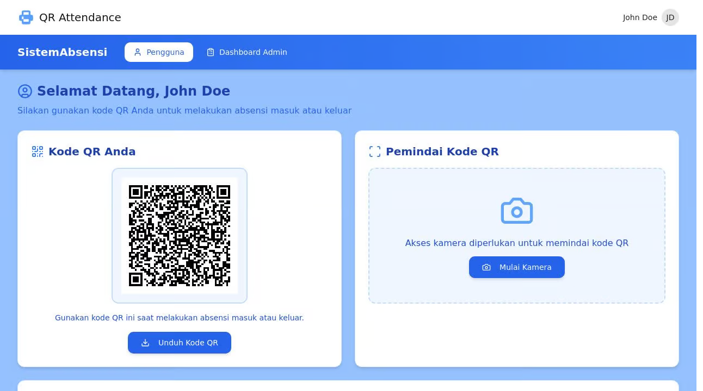

# QR Absensi - Sistem Absensi dengan QR Code

Sebuah aplikasi berbasis web untuk sistem kehadiran/absensi menggunakan teknologi QR Code dengan antarmuka dalam Bahasa Indonesia.

## Fitur Utama

- **Antarmuka Bahasa Indonesia:** Seluruh tampilan aplikasi menggunakan Bahasa Indonesia
- **Pemindaian QR Code:** Memindai kode QR untuk absensi masuk/keluar
- **Generasi QR Code:** Menghasilkan kode QR unik untuk setiap pengguna
- **Verifikasi PIN:** Keamanan tambahan menggunakan verifikasi PIN
- **Dashboard Admin:** Pantau kehadiran semua pengguna dalam satu tampilan
- **Panel Pengguna:** Lihat riwayat kehadiran dan kelola kode QR personal
- **Statistik Kehadiran:** Visualisasi data kehadiran untuk analisis cepat

## Teknologi yang Digunakan

- **Frontend:** React, TailwindCSS, Shadcn UI
- **Backend:** Express.js, Node.js
- **Database:** PostgreSQL dengan ORM Drizzle
- **QR Code:** QRCode.react untuk generasi, ZXing untuk pemindaian
- **Keamanan:** Express-session, Passport.js

## Cara Penggunaan

### Pengguna

1. Login ke akun pengguna
2. Tampilkan kode QR untuk dipindai oleh perangkat pemindai
3. Alternatif: Pindai kode QR pengguna lain (jika memiliki hak akses)
4. Verifikasi dengan memasukkan PIN
5. Lihat riwayat kehadiran di panel pengguna

### Admin

1. Login sebagai admin
2. Lihat statistik kehadiran di dashboard admin
3. Akses daftar lengkap pengguna dan riwayat kehadiran
4. Ekspor data (fitur akan datang)

## Pengembangan

### Prasyarat

- Node.js v18+ dan npm

### Instalasi

1. Clone repositori ini
2. Jalankan `npm install` untuk menginstal dependensi
3. Jalankan `npm run dev` untuk memulai server pengembangan

### Struktur Proyek

- `/client` - Kode frontend React
- `/server` - Kode backend Express
- `/shared` - Skema data dan tipe yang digunakan di frontend dan backend

## Rencana Pengembangan ke Depan

- Verifikasi lokasi berbasis geolokasi
- Pengenalan wajah sebagai metode verifikasi tambahan
- Notifikasi kehadiran melalui email/SMS
- Mode luar jaringan (offline) dengan sinkronisasi tunda
- Aplikasi seluler untuk kemudahan akses

## Kontribusi

silahkan email habizinnia@gmail.com jika butuh repo ini

## Lisensi

[MIT](LICENSE)